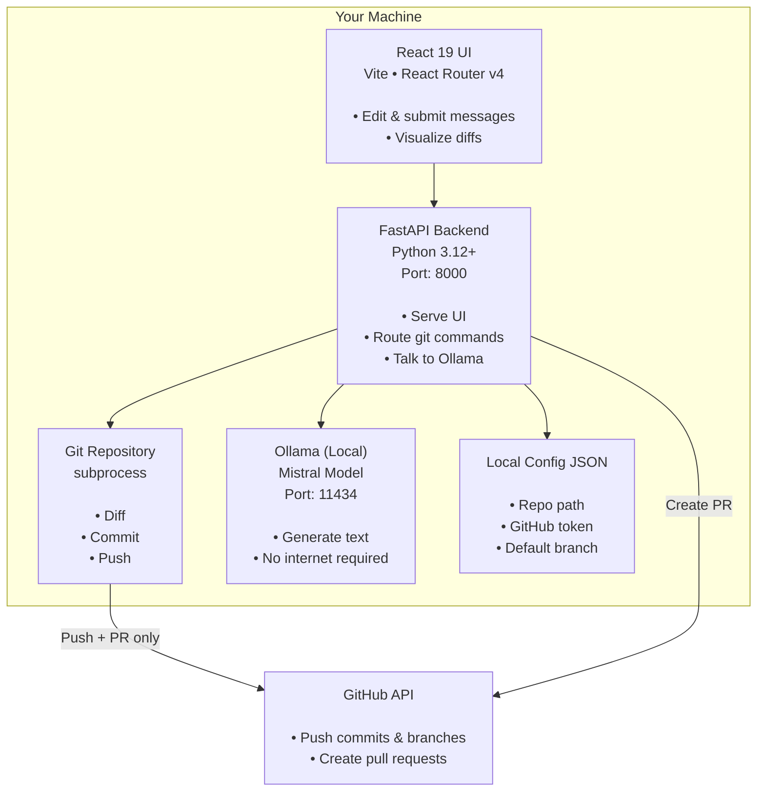

# DevLog
🌐 **Live Demo:** https://devlog-fawn-omega.vercel.app
<div align="center">
**✨ AI-powered Git workflow that stays 100% local. Generate commits, PRs, and push to GitHub—all without sending your code to the cloud.**

[](https://opensource.org/licenses/MIT)
[](https://www.python.org)
[](https://nodejs.org)
[](https://fastapi.tiangolo.com)
[](https://react.dev)
[](https://www.docker.com)

 [Documentation](#getting-started) • [Contributing](#contributing) • [Issues](https://github.com/Harsh63870/Devlog-main)

</div>

---

## 🎯 The Problem

Developers commit dozens of times daily. Writing clear commit messages and PR descriptions is **repetitive**, **time-consuming**, and **breaks flow**. Existing AI tools either:
- Send your code to cloud services (privacy + latency)
- Require complex setup or external dependencies
- Don't integrate into your workflow

## 💡 The Solution

**DevLog** runs AI entirely on your machine using [Ollama](https://ollama.com/). Generate git commits and PR descriptions locally, inspect the diff, edit if needed, then push with one click. Your code never leaves your machine unless *you* push it to GitHub.

**Zero cloud dependency. Zero privacy trade-offs. Lightning-fast inference.**

---

## ✨ Key Features

<table>
<tr>
<td>

### 🔒 **Privacy First**
- AI inference runs locally via Ollama (Mistral)
- Staged diff never uploaded to any service
- Code stays on your machine until explicitly pushed
- GitHub token stored locally, encrypted in config

</td>
<td>

### ⚡ **Instant Workflow**
- Read staged changes in <100ms
- Generate commit message in ~2-5s
- Generate PR description in ~3-8s
- One-click GitHub publish with validation

</td>
</tr>
<tr>
<td>

### 🎨 **Beautiful UI**
- React 19 + Tailwind v4 modern design
- Real-time diff visualization with syntax highlighting
- Interactive 3D commit graph and activity visualization
- Responsive desktop experience with keyboard shortcuts

</td>
<td>

### 🔧 **Developer Experience**
- Zero config for local usage (just `npm run dev` + `python -m uvicorn`)
- Docker Compose for multi-service orchestration
- Health checks and automatic recovery
- Full REST API for automation

</td>
</tr>
<tr>
<td>

### 📊 **Insights**
- Real-time repo status (branch, ahead/behind)
- Commit statistics and diff analysis
- Activity log with timestamps
- Test connection & validation before publishing

</td>
<td>

### 🚀 **Production Ready**
- Docker multi-stage builds
- Kubernetes-ready deployment guidance
- Health checks on all services
- Graceful error handling & logging

</td>
</tr>
</table>

---

## 🏗️ Architecture


**Why this architecture?**
- **No vendor lock-in:** Switch LLMs by changing Ollama model
- **Minimal dependencies:** FastAPI + Ollama, that's it
- **Offline-first:** Only GitHub API requires internet
- **Composable:** Run each service independently or dockerized

---

## 🚀 Quick Start

### Prerequisites

- **Python 3.12+** and **Node 22+**
- **Git** repository with staged changes
- **[Ollama](https://ollama.com/)** installed locally
  ```bash
  # Install from https://ollama.com/download
  # Then pull the Mistral model:
  ollama pull mistral
  ```

### Local Development (2 terminals)

#### Terminal 1: Backend
```bash
cd backend
python -m venv venv
source venv/bin/activate          # Windows: venv\Scripts\activate
pip install -r requirements.txt
uvicorn main:app --reload         # Runs on http://localhost:8000
```

#### Terminal 2: Frontend
```bash
cd frontend
npm install
npm run dev                        # Runs on http://localhost:5173
```

Visit **http://localhost:5173** → Configure repo path & GitHub token in **Settings** → Start generating!

### Docker Compose (All-in-One)

```bash
# Copy example env and edit
cp .env.example .env
# Set: REPO_PATH (path to your git repo), GITHUB_TOKEN (optional for now)

# Start all services
docker compose up --build          # ~2 min on first run

# Pull Mistral model (first time only)
docker compose exec ollama ollama pull mistral

# Access UI at http://localhost:3000
```

**Services:**
- Frontend (nginx): `http://localhost:3000`
- Backend (FastAPI): `http://localhost:8000`
- Ollama: `http://localhost:11434`

---

## 🎮 Usage Workflow

### Step 1: Stage Your Changes
```bash
git add src/features/new-feature.ts
```

### Step 2: Generate Commit Message
- Open DevLog UI → **Commit** tab
- Click **Generate** (powered by local Mistral)
- Review the generated message (~2-5 seconds)
- Edit if needed, then **Commit staged changes**

### Step 3: Generate PR Description
- Switch to **PR** tab
- Click **Generate** (reads the same diff)
- Review/edit title and body
- Click **Push & Open PR on GitHub**
- DevLog opens the PR link in your browser

### Step 4: Monitor & Iterate
- **Dashboard** shows commit stats, activity log
- **Repo status** displays ahead/behind counts
- **Git analysis** visualizes commit patterns

**Keyboard shortcuts available** — press `⌘K` (Mac) or `Ctrl+K` (Linux/Windows) to open command palette.

---

## ⚙️ Configuration

### Settings (UI or `.env`)

| Setting | Env Var | Default | Purpose |
|---------|---------|---------|---------|
| **Repository Path** | `REPO_PATH` | `.` | Absolute or relative path to git repo |
| **GitHub Token** | `GITHUB_TOKEN` | — | Personal Access Token for GitHub (stored locally) |
| **Default Base Branch** | `DEFAULT_BASE_BRANCH` | `main` | Branch to open PRs against |

### GitHub Token Setup

1. Go to [GitHub Personal Access Tokens](https://github.com/settings/tokens)
2. Create a **Fine-grained personal access token** with:
   - **Permissions:** `contents:read/write` on target repositories
   - **Expiration:** 90 days (rotate regularly)
3. Paste in DevLog **Settings** → **Test connection** validates scope
4. Token stored locally in `backend/devlog.local.json` (gitignored)

**Note:** Token is masked in UI (`••••••••`) but never transmitted to external services.

### Environment Variables

Create `.env` in project root:

```bash
# Git repository path (absolute recommended)
REPO_PATH=/Users/yourname/projects/my-repo

# GitHub Personal Access Token
GITHUB_TOKEN=ghp_xxxxxxxxxxxxxxxxxx

# Ollama connection (default: localhost)
OLLAMA_HOST=http://ollama:11434

# Backend port
BACKEND_PORT=8000
FRONTEND_PORT=3000

# Frontend API URL (for Docker/remote deployments)
VITE_API_URL=http://localhost:8000

# Config directory (for Docker)
DEVLOG_CONFIG_DIR=/app/data
```

---

## 📡 API Reference

All endpoints return JSON. Base URL: `http://localhost:8000`

### Health & Status

```
GET /health
```
Returns: `{ status: "ok" | "degraded", git_repo: bool, ollama: bool }`

```
GET /
```
Returns: `{ message: "DevLog API running 🚀" }`

### Git Operations (Local)

```
GET /git-diff
```
Returns staged changes as unified diff.
```json
{ "diff": "diff --git a/file.ts..." }
```

```
GET /repo-status
```
Returns branch, remote, ahead/behind.
```json
{
  "current_branch": "feat/new-feature",
  "remote": "origin",
  "ahead": 3,
  "behind": 0,
  "repo_owner": "username",
  "repo_name": "my-repo"
}
```

### AI Generation (Local Ollama)

```
GET /generate-commit
```
Generates conventional commit message.
```json
{
  "message": "feat: add user authentication module",
  "time_taken_sec": 4.23
}
```

```
GET /generate-pr
```
Generates GitHub PR description.
```json
{
  "description": "## Summary\nAdded authentication...\n## Changes\n- ...",
  "time_taken_sec": 6.15
}
```

### GitHub Publishing

```
POST /commit
Body: { "message": "feat: add feature" }
```
Commits staged changes.
```json
{ "success": true, "commit_hash": "abc123def456", "error": null }
```

```
POST /push
Body: { "branch": "feat/new-feature" }
```
Pushes branch to origin.
```json
{ "success": true, "output": "...", "error": null }
```

```
POST /create-pr
Body: {
  "title": "Add feature X",
  "body": "## Summary...",
  "base": "main",
  "head": "feat/new-feature"
}
```
Opens PR on GitHub.
```json
{
  "success": true,
  "pr_url": "https://github.com/user/repo/pull/42",
  "pr_number": 42,
  "error": null
}
```

### Settings

```
GET /settings
```
Returns current config (token masked).
```json
{
  "repo_path": "/home/user/my-repo",
  "github_token": "••••••••",
  "default_base_branch": "main"
}
```

```
POST /settings
Body: { "repo_path": "...", "github_token": "...", "default_base_branch": "..." }
```
Updates and persists settings.

---

## 🐳 Docker Deployment

### Compose (Recommended for Local)

```bash
docker compose up --build -d
docker compose logs -f backend
```

### Environment Variables for Docker

```yaml
# .env
REPO_PATH=/home/user/projects/my-repo
GITHUB_TOKEN=ghp_xxxx
VITE_API_URL=http://localhost:8000
OLLAMA_HOST=http://ollama:11434
DEVLOG_CONFIG_DIR=/app/data
BACKEND_PORT=8000
FRONTEND_PORT=3000
```

### Volumes

| Volume | Mount | Purpose |
|--------|-------|---------|
| `devlog-config` | `/app/data` | Persists settings, tokens |
| `ollama-data` | `/root/.ollama` | Model cache (large!) |
| Host `${REPO_PATH}` | `/repo` | Your git repository |

### Health Checks

- **Backend:** `GET /health` — responds with git + Ollama status
- **Frontend:** `GET /health` on nginx — simple 200 OK
- **Ollama:** `ollama list` command check

---

## ☸️ Kubernetes Deployment

DevLog is Kubernetes-ready. Here's the canonical K8s mapping:

```yaml
# backend-deployment.yaml
apiVersion: apps/v1
kind: Deployment
metadata:
  name: devlog-backend
spec:
  replicas: 1
  template:
    spec:
      containers:
      - name: backend
        image: devlog:latest
        ports:
        - containerPort: 8000
        env:
        - name: REPO_PATH
          value: /repo
        - name: GITHUB_TOKEN
          valueFrom:
            secretKeyRef:
              name: devlog-secrets
              key: github-token
        - name: OLLAMA_HOST
          value: http://devlog-ollama:11434
        volumeMounts:
        - name: repo
          mountPath: /repo
        - name: config
          mountPath: /app/data
        livenessProbe:
          httpGet:
            path: /health
            port: 8000
          initialDelaySeconds: 20
          periodSeconds: 30
      volumes:
      - name: repo
        hostPath:
          path: /path/to/repo
          type: Directory
      - name: config
        persistentVolumeClaim:
          claimName: devlog-config
---
# frontend-deployment.yaml
apiVersion: apps/v1
kind: Deployment
metadata:
  name: devlog-frontend
spec:
  replicas: 2
  template:
    spec:
      containers:
      - name: frontend
        image: devlog-frontend:latest
        ports:
        - containerPort: 80
        env:
        - name: VITE_API_URL
          value: http://devlog-backend:8000
        livenessProbe:
          httpGet:
            path: /health
            port: 80
          initialDelaySeconds: 10
          periodSeconds: 30
---
# ollama-deployment.yaml
apiVersion: apps/v1
kind: Deployment
metadata:
  name: devlog-ollama
spec:
  replicas: 1
  template:
    spec:
      containers:
      - name: ollama
        image: ollama/ollama:latest
        ports:
        - containerPort: 11434
        volumeMounts:
        - name: ollama-data
          mountPath: /root/.ollama
        resources:
          requests:
            memory: "4Gi"
            cpu: "2"
          limits:
            memory: "8Gi"
            cpu: "4"
      volumes:
      - name: ollama-data
        persistentVolumeClaim:
          claimName: ollama-data
```

**Key notes:**
- Ollama requires significant GPU/CPU resources → consider node selectors
- Config PVC shared between backend pods
- Frontend can be replicated; backend typically runs 1 (stateful git operations)
- Repo volume via hostPath or git sidecar init container

---

## 🔒 Security Considerations

### What Stays Private
- ✅ Git diffs never sent to external services
- ✅ GitHub token stored locally, encrypted
- ✅ Commit/PR generation runs on your machine
- ✅ Ollama inference never leaves the network

### What Touches GitHub
- ❌ Branch pushes (you explicitly choose this)
- ❌ PR creation (requires GitHub API, authenticated with your token)
- ❌ That's it.

### Best Practices
1. **Use Fine-Grained Tokens:** Limit GitHub PAT scope to specific repos/permissions
2. **Rotate Tokens:** Set expiration to 90 days, rotate regularly
3. **Secure Ollama:** If exposing over network, use reverse proxy + auth
4. **Audit Locally:** Review generated messages before publishing
5. **Environment Variables:** Don't commit `.env` or `devlog.local.json`

---

## 📦 Tech Stack

<table>
<tr>
<td>

**Frontend**
- React 19 + TypeScript
- Vite 8 (build tool)
- Tailwind CSS v4
- Framer Motion (animations)
- TanStack Query (data fetching)
- Zustand (state management)
- Three.js + React Three Fiber (3D graphs)
- Lucide React (icons)
- Sonner (toast notifications)

</td>
<td>

**Backend**
- Python 3.12+
- FastAPI 0.136+
- Ollama SDK (LLM inference)
- Pydantic v2 (validation)
- python-dotenv (config)
- uvicorn (ASGI server)

</td>
</tr>
<tr>
<td>

**Infrastructure**
- Docker & Docker Compose
- Nginx (frontend reverse proxy)
- Kubernetes-ready
- GitHub REST API v3

</td>
<td>

**Development Tools**
- ESLint + Prettier
- TypeScript strict mode
- Vite HMR (hot reload)
- pytest-ready (no tests yet)

</td>
</tr>
</table>

---

## 📈 Performance

### Typical Timings (on M1 MacBook Pro)

| Operation | Time | Notes |
|-----------|------|-------|
| Read staged diff | 50-150ms | Depends on diff size |
| Generate commit | 2-5s | Mistral model on CPU |
| Generate PR | 3-8s | Longer, more tokens |
| Commit operation | 100-200ms | Git subprocess |
| Push branch | 1-3s | Network-dependent |
| Create PR | 0.5-2s | GitHub API latency |

**Bottleneck:** Mistral on CPU. With GPU:
- RTX 4090: ~0.5-1s per generation
- M-series GPU: ~1-2s per generation

---

## 🤝 Contributing

We ❤️ contributions! Here's how to help:

### Development Setup

```bash
# Clone and install
git clone https://github.com/Harsh63870/Devlog-main.git
cd Devlog-main

# Backend
cd backend
python -m venv venv && source venv/bin/activate
pip install -r requirements.txt

# Frontend
cd ../frontend
npm install

# Start both (in separate terminals)
uvicorn main:app --reload    # Backend
npm run dev                   # Frontend
```

### Areas We Need Help

- **Tests:** Backend (pytest + mocked git/GitHub), Frontend (Vitest)
- **Features:** Commit history, markdown export, multiple repos
- **Docs:** Deployment guides, troubleshooting, FAQs
- **UX:** Keyboard shortcuts, dark mode, accessibility
- **Performance:** LLM prompt tuning, model switching UI

### Code Style

- **Python:** Black + isort
- **TypeScript:** ESLint + Prettier
- **Commit messages:** Conventional Commits

```bash
# Format before pushing
black backend/
npm run lint -- --fix
```

### Pull Request Process

1. Fork the repo
2. Create a feature branch: `git checkout -b feat/your-feature`
3. Commit with conventional messages: `git commit -m "feat: add X"`
4. Push and open a PR with a clear description
5. Respond to feedback, we'll merge!


## ❓ FAQ

**Q: Is my code sent to OpenAI/Anthropic/cloud?**
A: No. Ollama runs locally on your machine. Your code never leaves unless you `git push`.

**Q: Can I use GPT-4 or Claude instead of Mistral?**
A: Not yet. Ollama is local-only. We're exploring Ollama's streaming models and plan template support for different providers.

**Q: How much disk space for the model?**
A: Mistral ~5GB, Llama 2 ~7GB. Stored in `~/.ollama` (Ollama default).

**Q: Can I run this on Windows?**
A: Yes! Python 3.12, Node 22, Ollama all support Windows. Use `venv\Scripts\activate` instead of `source venv/bin/activate`.

**Q: What if I don't have a GitHub token?**
A: You can still generate commits and review diffs locally. GitHub publishing requires a token.

**Q: Can I self-host this?**
A: Yes, absolutely. Docker Compose + Kubernetes docs provided. It's designed to be self-contained.

**Q: Does it work offline?**
A: Yes, except for GitHub operations (which require internet). Everything else works offline.

**Q: How do I report bugs?**
A: Open an issue on [GitHub](https://github.com/Harsh63870/Devlog-main/issues) with:
  - OS & Python/Node versions
  - Steps to reproduce
  - Error message / logs
  - Expected vs. actual behavior

---

## 📝 License

MIT License . See [LICENSE](./LICENSE) for details.

Contributions, citations, and attribution appreciated but not required. Use freely for personal, commercial, or educational purposes.

---

## 🙏 Acknowledgments

- [Ollama](https://ollama.com/) for local LLM infrastructure
- [FastAPI](https://fastapi.tiangolo.com/) for the excellent framework
- [React 19](https://react.dev) and [Vite](https://vitejs.dev/) teams
- [Tailwind CSS](https://tailwindcss.com/) for utility-first styling
- [Conventional Commits](https://www.conventionalcommits.org/) specification

---

<div align="center">

**Made with ❤️ by developers, for developers.**

[⭐ Star us on GitHub](https://github.com/Harsh63870/Devlog-main) • [📧 Email](mailto:harshvardhanpandey372@gmail.com) 

</div>
