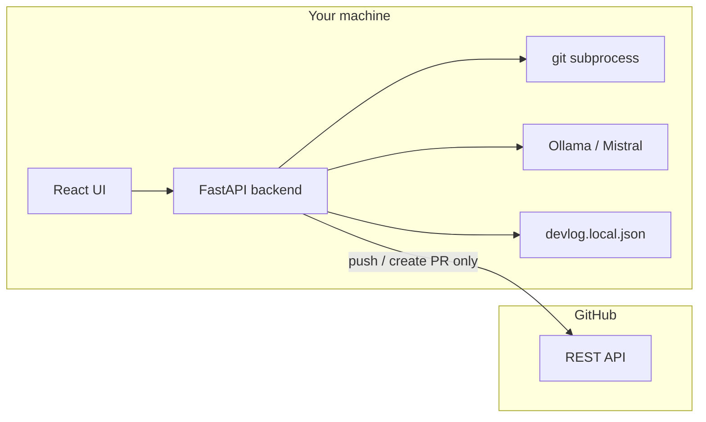

# DevLog

AI-powered Git commit and PR generator with real GitHub publishing.

## Features

- Reads staged git diff from your configured repository
- Generates commit messages and PR descriptions locally via Ollama (Mistral)
- Commits staged changes, pushes branches, and opens pull requests on GitHub
- Diff statistics, copy-to-clipboard, activity log
- React 19 + FastAPI architecture with Docker support

## What stays local vs. what talks to GitHub

| Action | Where it runs |
|--------|---------------|
| Scan diff, generate commit, generate PR | **Local** — Ollama on your machine |
| Commit, push | **Local git** — subprocess in configured `REPO_PATH` |
| Open pull request | **GitHub REST API** — the one external network hop |

AI generation never sends your code to GitHub. Only explicit publish actions (push, create PR) use the network.

## Tech Stack

**Frontend:** React 19, Vite, Tailwind v4, Framer Motion, TanStack Query, Zustand

**Backend:** FastAPI, Ollama, Pydantic, python-dotenv

**Infrastructure:** Docker, docker-compose, nginx (frontend), Ollama container

## Architecture



## Workflow

```
git add .
    ↓
Generate commit message (local AI)
    ↓
Commit staged changes (git)
    ↓
Generate PR description (local AI)
    ↓
Push branch + open PR (GitHub API)
```

## Run Locally

### Prerequisites

- Python 3.12+, Node 22+
- [Ollama](https://ollama.com/) with `mistral` pulled: `ollama pull mistral`
- A git repository with staged changes

### Backend

```bash
cd backend
python -m venv venv
source venv/bin/activate   # Windows: venv\Scripts\activate
pip install -r requirements.txt
uvicorn main:app --reload
```

### Frontend

```bash
cd frontend
npm install
npm run dev
```

Open http://localhost:5173. Configure your repo path and GitHub token in **Settings**.

## Publishing

### Settings

Configure in the Settings view (persisted to `backend/devlog.local.json`, gitignored):

| Setting | Env var | Default |
|---------|---------|---------|
| Repository path | `REPO_PATH` | `.` |
| GitHub token | `GITHUB_TOKEN` | — |
| Default base branch | `DEFAULT_BASE_BRANCH` | `main` |

Use **Test connection** to verify repo path, branch, owner/repo, and ahead/behind counts.

### GitHub token scopes

Create a [Personal Access Token](https://github.com/settings/tokens) with:

- **`repo`** — full access for private repositories
- **`public_repo`** — sufficient for public repositories only

The token is stored locally and never returned unmasked by the API.

### Publish flow

1. **Commit view** — generate a message, then **Commit staged changes** (confirmation required)
2. **PR view** — generate a description, edit title/body, then **Push & Open PR on GitHub**
3. On success, open the PR link directly from the UI

## API Endpoints

| Method | Path | Description |
|--------|------|-------------|
| GET | `/` | API status |
| GET | `/health` | Health check (git repo + Ollama) |
| GET | `/warmup` | Preload Ollama model |
| GET | `/git-diff` | Staged diff |
| GET | `/generate-commit` | AI commit message (local) |
| GET | `/generate-pr` | AI PR description (local) |
| GET | `/settings` | Current config (token masked) |
| POST | `/settings` | Update config |
| GET | `/repo-status` | Branch, remote, ahead/behind |
| POST | `/commit` | Commit staged changes |
| POST | `/push` | Push branch to origin |
| POST | `/create-pr` | Open GitHub pull request |

## Docker

### Quick start

```bash
cp .env.example .env
# Edit .env — set REPO_PATH, GITHUB_TOKEN

docker compose up --build
```

| Service | URL | Purpose |
|---------|-----|---------|
| Frontend | http://localhost:3000 | React UI (nginx) |
| Backend | http://localhost:8000 | FastAPI |
| Ollama | http://localhost:11434 | Local AI |

Pull the model on first run:

```bash
docker compose exec ollama ollama pull mistral
```

### Volumes

| Volume | Mount | Purpose |
|--------|-------|---------|
| `devlog-config` | `/app/data` | Persisted settings (token, repo path) |
| `ollama-data` | `/root/.ollama` | Model cache |
| Host `${REPO_PATH}` | `/repo` | Git repository (read/write for commit/push) |

### Environment variables

See `.env.example` for all options. Key variables:

- `REPO_PATH` — host path to your git repo
- `GITHUB_TOKEN` — GitHub PAT for publishing
- `VITE_API_URL` — backend URL as seen by the browser (default `http://localhost:8000`)
- `BACKEND_PORT` / `FRONTEND_PORT` — host port mappings

### Kubernetes notes

The compose layout maps cleanly to K8s:

- **backend** Deployment + Service (port 8000) + PVC for `devlog-config`
- **frontend** Deployment + Service (port 80) — stateless, built with `VITE_API_URL` pointing to backend Ingress
- **ollama** Deployment + Service (port 11434) + PVC for model storage
- Repo access via hostPath or sidecar volume mount
- Secrets for `GITHUB_TOKEN` via K8s Secret → env var

Health probes: `GET /health` on backend, `GET /health` on frontend nginx.

## Future Improvements

- Backend tests (pytest, mocked subprocess + GitHub)
- Git credential helper integration in containers
- Commit history and markdown export
